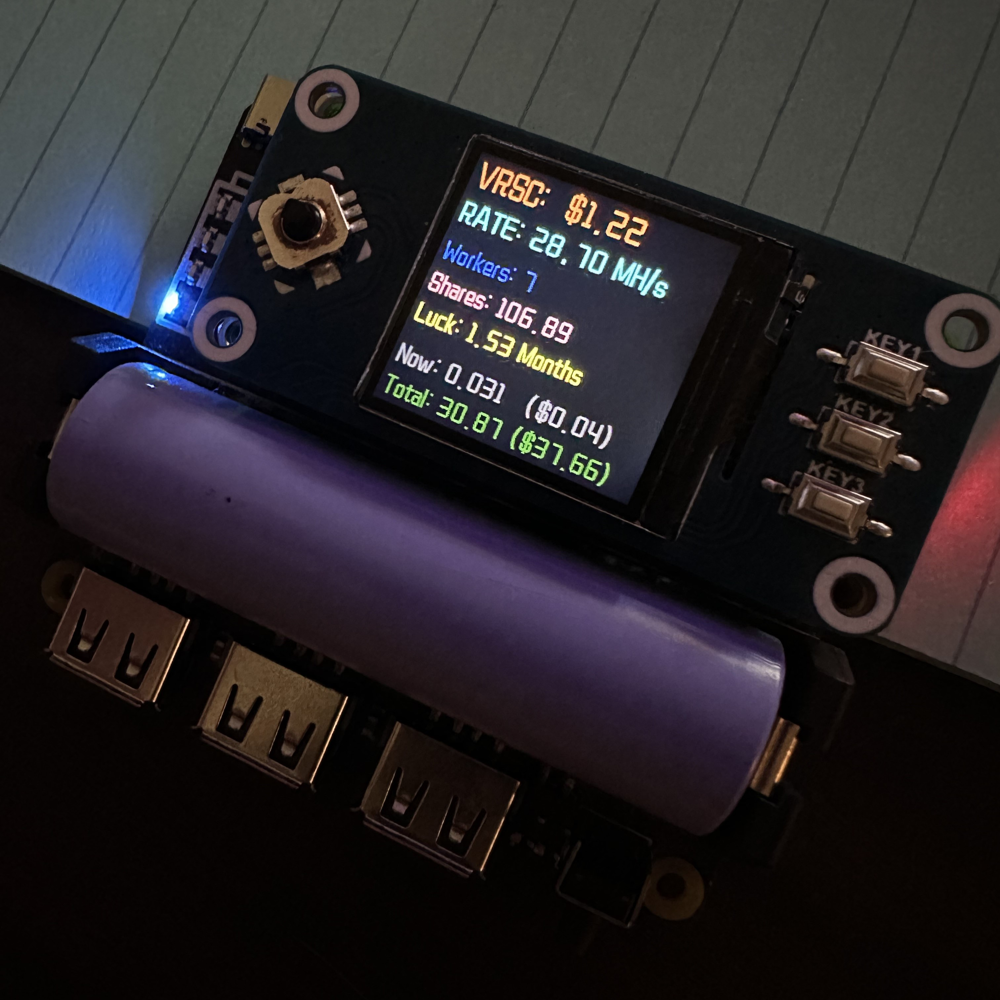

# 1.3inch LCD HAT

<div style="display: flex; gap: 10px;">   
    
</div>

This project demonstrates how to use a 1.3-inch LCD HAT with a Raspberry Pi to display Verus miner stats and fortune messages.

# Materials
* [Raspberry Pi 5](https://amzn.to/45zrAKI) / [4](https://amzn.to/3KQlkVv) / [3](https://amzn.to/3xs2iSm) / [Zero 2 WH](https://amzn.to/3VO7eu2)<br />
* [Micro SD Cards](https://amzn.to/4erXgWD)<br />
* [1.3inch LCD HAT](https://amzn.to/3LkyXwB)<br />
* [UPS Hat](https://amzn.to/4ceZp6I) / [UPS Hat](https://amzn.to/3zHiccm)<br />
<br />
(Amazon affiliate links)<br />


## **Installations**

1. **OS install:**
   - Install Raspberry Pi OS Lite (64-bit) on your Raspberry Pi <br />
   
2. **Enable SPI & I2C:**
   - Open a terminal on your Raspberry Pi.
   - Run sudo raspi-config.
   - Navigate to Interfacing Options -> SPI -> Enable.
   - Navigate to Interfacing Options -> I2C -> Enable.

3. **Python libraries:**
   - sudo apt-get update
   - sudo apt-get install python3-pip
   - sudo apt-get install python3-pil
   - sudo apt-get install python3-numpy
   - sudo pip3 install spidev
   <br />

# Wiring and Setup
1. **Connect 1.3inch LCD HAT to Raspberry Pi:**
   - Connect the 1.3inch LCD HAT to your Raspberry Pi. <br />
   - Connect the UPS Hat for continuous power supply. This will allow you to move the project anywhere without worrying about power interruptions.

2. Clone the repository:
   ```bash
   sudo apt install git -y
   git clone https://github.com/frogCaller/1.3inch.git
   cd 1.3inch
  
# Usage Instructions
1. Edit `main.py` to add your Verus Wallet Address:
  - Open main.py in a text editor.
    ```
    nano main.py
    ```
  - Locate the line where the wallet address is defined and replace the placeholder with your own Verus wallet address.
    ```
    wallet_address = "VERUS_WALLET_ADDRESS"
    ```
    
2. Display Verus miner stats:
   - Run the script: `python3 main.py`

3. Display fortune messages:
   - Utilize the fortune command to display random quotes.
   - Make sure you have fortune installed. `sudo apt install fortune -y`
   - Use the left and right arrows to display a fortune.
4. More:
   - You can edit the buttons in the code to make them do whatever you want.
   - Modify the check_buttons() function in the script to customize the button actions according to your requirements.
# Troubleshooting
Common Issues:
   - Ensure SPI & I2C are enabled in the Raspberry Pi configuration.
   - Check all connections if the screen does not display anything.
   - Verify all required packages are installed correctly.
   - [More Info](https://www.waveshare.com/wiki/1.3inch_LCD_HAT)
